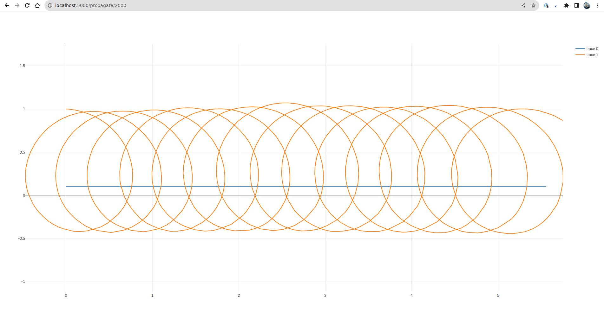
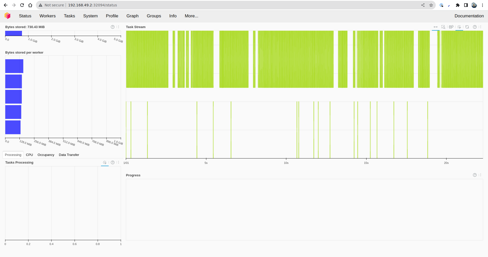
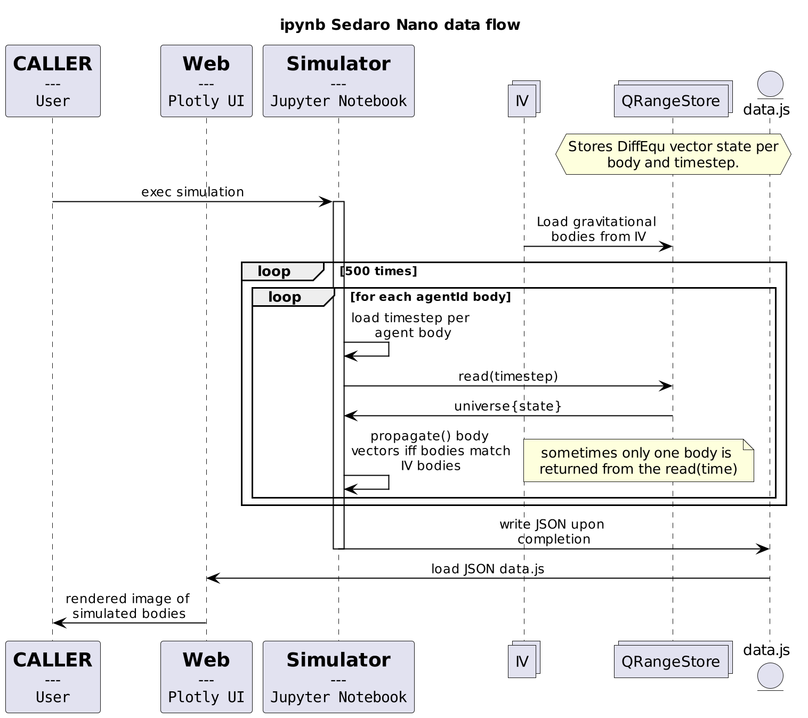

# Sedaro Nano - Infra Edition

It was quite the learning and humbling experience getting all these systems(Terraform CDKTF, Dask, and Flask) running and working together. Satisfied to have the web app dynamically setting two body propagation steps, bookmarking prior to building Docker image of app, injecting into minikube, and Deployment boilerplate. Parallelism is ham-fisted at submitting propagation tasks accepting state by parameters. Presumably there's a much better way to do it via Dask Array, or Dataframes.


(flask app dynamically querying propagation iterations)


(dask-dashboard running in minikube, connected via nodeport, not the most efficient parallelization)

# CDKTF Requirements and Implementation plan

Document process of analysis, time constrained development process, and final bookmarked functionality.


(analysis of the original DiffEqu Propagation algorithm and html display)

Implement Kubernetes deployment of sedaro-nano supporting services utilizing CDKTF(Typescript).

Utilize Dask distributed processing to parallelize propagation calculation. Ideally share and forward necessary state(QRangeStore data + previous timesteps) to propagation calculations, then reduce calculated state to inform downstream calculation.

HTTP request to Frontend checks Redis for previously calculated `data.js`, keyed by the number of propagation iterations. If the data does not exist, submit work to Dask, and when complete write to redis. Once written to Redis, webpage will automatically render.

Document the lack of security controls, tests, proper error handling, horizontal scalability, and situation.

# Bootstrap to run

## Conditions of execution

* `minikube version: v1.31.2`
  * Requires `.kube/config.minikube` configured by `minikube start` to contain the `minikube` configuration context.
  * eg: `tf/main.ts` cdktf configuration:
  ```
    new KubernetesProvider(this, "kubernetes", {
      configContext: "minikube",
      configPath: "~/.kube/config.minikube",
    });
  ```
  * Recommend 4 CPU and 4GB of memory for minikube
* cdktf installed: `0.18.0`
  * requires node 18+: `v18.17.1`
  * npm: `@9.6.7`
* Python `3.9.16`+ (to run flask outside of minikube)
  * venv for package management

## Launch

Commands are defined in `tf/Makefile` but can also be executed manually.

1. Navigate into the `tf/` directory where all the `cdktf` project files are.
1. `make start` - starts minikube
1. `make deploy` - cdktf synth and deploy of `main.ts` This will deploy dask-scheduler, dask-workers, dask-dashboard, and redis to minikube. Along with expose services.
1. `make minikube-services` will display ports to access the Dask workers. *Note*: the `redis-port` and `dask-scheduler-api` port URLs for configuring the Flask app.
1. Set REDIS and DASK_SCHEDULER envvars to run the Flask app. eg: `export DASK_SCHEDULER=192.168.49.2:31138` `export REDIS=192.168.49.2:32217`
1. Ensure running in a python virtual env: `python3 -m venv .venv`
1. Activate venv: `source .venv/bin/activate`
1. Install required packages(a bit bloated from local dask testing): `pip install -r requirements.txt`
1. From the project's root directory `sedaro-nano/` execute `make flask` or `flask --app porta run`
1. Navigate via web browser to [the local flask service](http://localhost:5000/propagate/200), and wait for propagation to complete.
1. Dynamically change the number of propagated steps via the last path integer, eg: [2000](http://localhost:5000/propagate/2000)

Note: Larger propagations take a while and may not display after workers are finished, so refresh and it will immediately load from Redis.

# Security

### Confidentiality

* Minikube service authentication: Certificates, stored in unecrypted files, on encrypted filesystem.
* Minikube Pod Inter-Network traffic encryption: None
* Flask AuthN & AuthZ: None
* Flask encryption: None
* Dask [Scheduler, Worker, Dashboard] AuthN & AuthZ: None
* Dask data encryption: None(AFAIK)
* Redis data encryption: None

### Integrity

* Minikube authorization: full administration control via config generated certificate tokens.
* Redis is the only data store, and it is in ephemeral mode for simplicity. If it crashes all cached data is lost. K.I.S.S.
* There are no controls tracking logs or monitoring for data tampering inside minikube, all deployments vulnerable.

### Availability

* All services are hosted and horizontally scalable via Deployments. All it takes is changing the replica count in `main.ts` to increase the number of Dask workers(if the work can be properly parallelized).
* Minikube dies, it all dies.
* In a proper managed Kubernetes cluster, Node outages would move Pods to functional Nodes to minimize service interruption.


## Complications

* CDKTF[Typescript] dependency on NPM(from previously existing environment) threw a number of errors until fully rebuilding dev environment.
  * Fell into CDKTF Constructs hole, appears to be low value-per-complexity for a simple project.
* Stable Dask versions(2023.01.0) is on Python 3.8, but `sim.ipynb` utilizes Python 3.9+ methods requiring Dask 2023.8.+. Python3 ecosystem has is less stable than anticipated.
* Dask Array, DataFrames, or Bag for QRange `store`? The DiffEqu Propagation algorithm makes sense, but I need to understand Dask's data structures, and capabilities better to fully take advantage of it's parallelism.
  * Used `client.upload_file(..)` to supply propagation code to workers from flask app. Unsure of true best practices.
* There was an unfortunate amount of learn by doing, not testing, so lacking in base of unit tests for future stability. Time, and context switching constrained with a day job.


## Kubernetes Resources

### Namespace

* sedaro(all downstream resources installed in the namespace)

### Services

* Flask
* dask-notebook(jupyter)
* dask-scheduler
* redis

### Deployments

Ideally all envs run identical Python environments. [Efficiency made by using published ]

* dask-scheduler (1)
* dask-workers (3 to start)
* jupyter-notebook (1, with dask plugin installed)

* `porta` frontend: Flask
  * Responds to http requests
  * Consults Redis to check if data already cached
  * Launches dask workers if data not cached
    * (not the case)Optimally only one request to Dask for work to be done will be made but first keeping the solution simple.
* Backend to cache data.js: Redis
  * key path: `redis:/propagation[<int: step count>]`

## TODO:

* [x] Create minikube cluster
* [x] define TF K8s resources vi CDKTF
* [ ] ~CDKTF conversion of TF declarations~ not needed, use Typescript for all simple declarations.
  * [x] Deploy to minikube
  * [x] Expose port to host machine via Service[LoadBalancer || NodePort]
* [x] `minikube` setup
  * [x] `minikube tunnel`
  * [ ] `minikube` forward local docker registry 
* [x] Dask invoked from Flask service frontend: `porta`
  * [x] EnvVars to configure: `DASK_SCHEDULER={minikube-addr}:{minikube-nodeport} REDIS_ADDR= flask --app porta run`
  * [ ] Invoke dask-scheduler to distribute propagation tasks to workers, collect results.
  * [ ] Cache results in Redis for 

**Bookmark point**
* [ ] (started) Dockerfile to build flask app image
* [ ] `minikube start --insecure-registry...` to upload flask app image for execution.
  * [ ] CDKTF Deployment for `porta`
  * [x] CDKTF Service(with exposed NodePort) for `porta`


